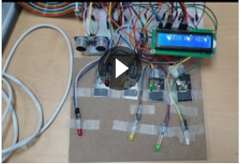
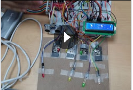
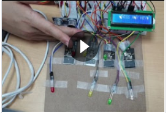
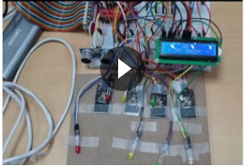
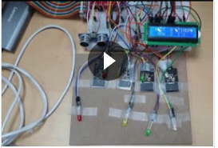

라즈베리파이를 이용한 미니 게임기
---
초음파 센서를 이용해 유저의 거리를 확인하고, 일정 거리에 가까워지면 게임 플레이 여부를 묻습니다.  
주어진 시간 동안 아무 키나 누르면 게임이 진행됩니다.
기억력 게임으로 무작위로 LED가 켜지면 순서에 맞게 터치해야합니다.
순서가 틀리거나, 시간이 초과되면 FAIL!
---
* 게임 대기 상태

* 게임 실행중 상태
1. 시간 초과
- 시간 초과

- 시간 초과 후 신기록 수립

2. 잘못된 순서 입력
- 잘못된 순서 입력

- 잘못된 순서 입력 후 신기록 수립

